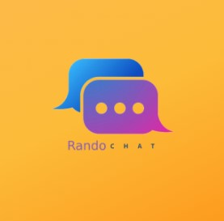
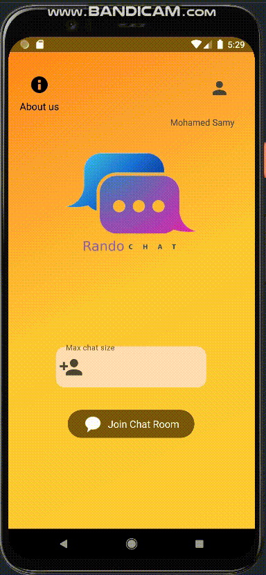
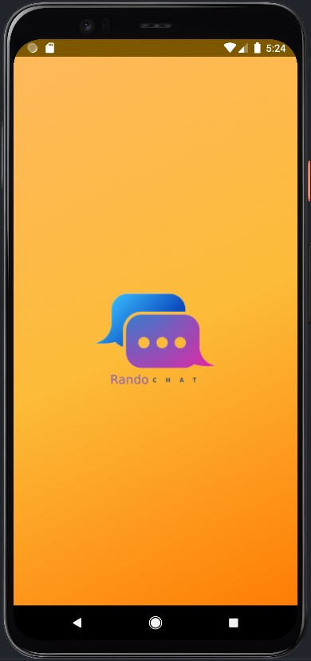
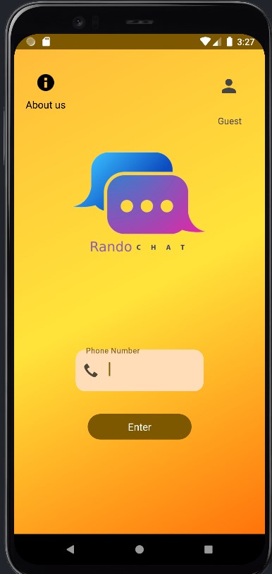
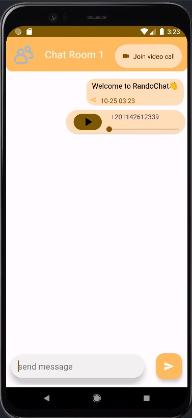
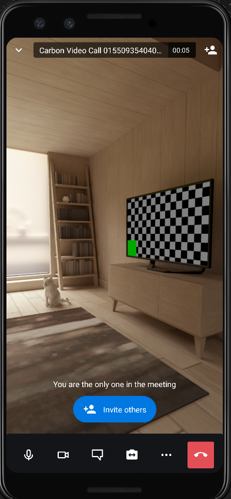
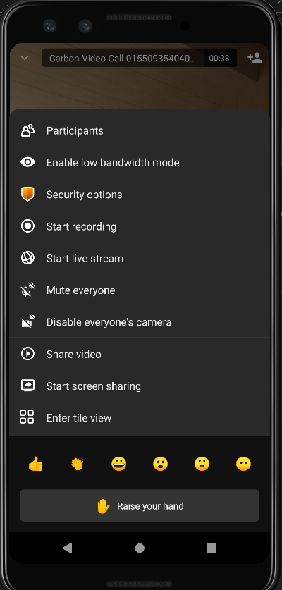
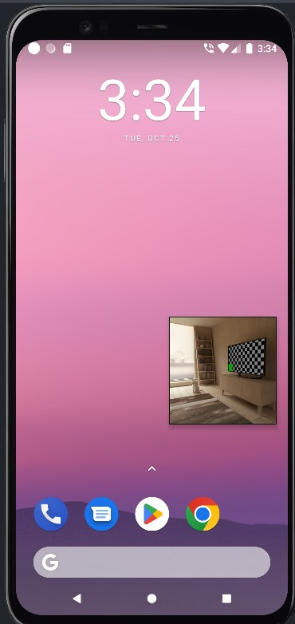

# RandoChat

 </em>
 
<em>Android live chat application. </em>

 

### A Chat application that lets you interact and communicate with new people

## Features

- Splash Screen.
- Phone Login and register.
- One-to-One chat.
- Group chats.
- Images and text stories.
- Audio records.
- Message encoding
- Video/Audio calls.
- Data privacy.
- View and edit profile.
- Conference rooms with streaming,recording,voting and security features.

# In App Screenshots

## Home

<!--  -->

Animated home screen with an option to choose max room size

## Splash screen

<!--  -->

App splash screen

<!-- ## Registeration

<!--  -->

<!-- Registeration screen --> 

## Login

<!--  -->

Login screen with OTP authentication

## Chat Room

<!--  -->

Chat Room with one to one chats , group chats and voice notes support

## Video call

<!--  -->

## Video call options

<!--  -->

## Floating window (PIP) videocall

<!--  -->

# Technologies

## Android

- Supports Android 8 Oreo and above.
- Google material 3 design.
- Data binding
- Kotlin coroutines

## Firebase

- Cloud Firestore.
- Realtime database.
- Cloud Storage.
- Phone Authentication.

## WebRTC

- Implemented by Jitsi SDK.
- peer to peer network calls.
- Secure call cnnections
- Group video and audio calls, polls and streaming the phone's screen.

## Dependencies

- Multidex.
- Recycler view and Card view.
- hdodenhof circular image.
- intuint SDP and SSP.
- sarnavakonar text writer.
- Jitsi SDK.
- Lottie animations.
- Kotlin Extenstions.
